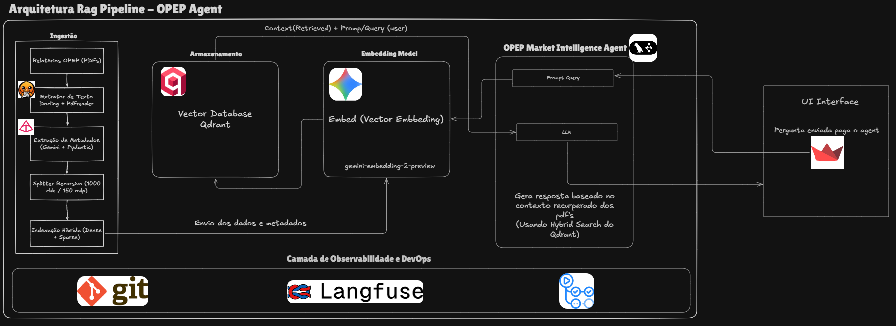

# 🛢️ OPEP Market Intelligence - RAG Pipeline




Uma plataforma avançada de mineração de inteligência sobre o mercado global de commodities energéticas, baseada nos relatórios mensais **MOMR (Monthly Oil Market Report)** da OPEP. Este projeto utiliza uma arquitetura RAG (Retrieval-Augmented Generation) para fornecer análises precisas, citando fontes e tendências extraídas diretamente dos documentos oficiais.

## 🏗️ Arquitetura do Sistema

O pipeline é dividido em duas frentes principais:

1.  **ETL & Ingestão:** Extração de texto de PDFs, mineração de metadados com LLM (Pydantic) e indexação híbrida no Qdrant.
2.  **RAG Agent (LangGraph):** Um grafo de estados que gerencia a recuperação de contexto e a geração de respostas com uma persona de Consultor Sênior.

## 🛠️ Stack Tecnológica

- **Linguagem:** Python 3.11+
- **Gerenciador de Pacotes:** [uv](https://github.com/astral-sh/uv) (Extremamente rápido)
- **Orquestração de IA:** [LangChain](https://github.com/langchain-ai/langchain) & [LangGraph](https://github.com/langchain-ai/langgraph)
- **LLM & Embeddings:** Google Gemini (Gemini 2.0 Flash & Embedding-004)
- **Banco Vetorial:** Qdrant (Busca Híbrida: Dense + Sparse/BM25)
- **Observabilidade:** Langfuse
- **Interface:** Streamlit

## 🚀 Como Executar

### Pré-requisitos

1.  Possuir o `uv` instalado (`pip install uv`).
2.  Docker Desktop (para rodar o Qdrant).
3.  Chaves de API do Google AI Studio e Langfuse.

### Configuração Inicial

1.  Clone o repositório:
    ```bash
    git clone https://github.com/luizfernandoOliveiraa/OPEP-Oil-Rag-Pipeline.git
    cd OPEP-Oil-Rag-Pipeline
    ```

2.  Configure o ambiente:
    ```bash
    cp .env.example .env  # Crie seu .env com as chaves necessárias
    ```

3.  Suba o Banco Vetorial:
    ```bash
    docker-compose up -d
    ```

### Execução dos Processos

**1. Ingestão de Dados (ETL):**
Coloque seus arquivos PDF na pasta `./data/` e rode o processo de indexação:
```bash
uv run python -m src.etl.ingest
```

**2. Interface do Chat (Streamlit):**
```bash
uv run streamlit run app.py
```

## 📈 CI/CD e Qualidade

O projeto conta com automação via GitHub Actions para:
- Validação de ambiente com `uv`.
- Linting automático do código.

## 📄 Licença

Este projeto está sob a licença MIT. Veja o arquivo [LICENSE](LICENSE) para detalhes.

---
*Desenvolvido para análise de mercado energético de alta performance.*
